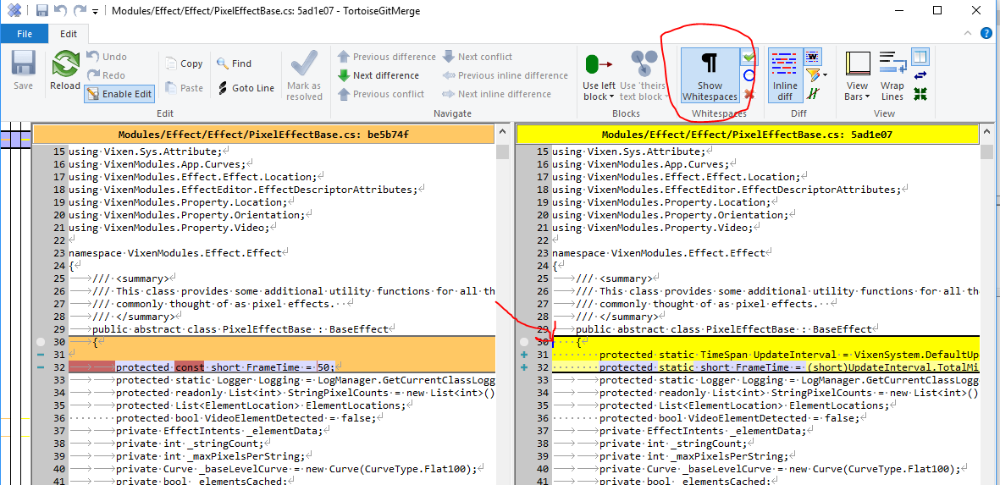

## General Info

We currently use Visual Studio 2026 for development. You can use the community or free version that MS provides, or any of the higher paid versions. The current community version is quite good and is mostly equivalent to the old Professional version. The vast majority of the code is in C#, with a small portion in C++. When you install Visual Studio, you will need the C++ build tools.

## Settings

Code formatting (tabs instead of spaces, indent size, line endings, and C#/VB naming conventions) is governed by the `.editorconfig` files checked into the repository — the root `.editorconfig` and `src/.editorconfig`. Visual Studio has built-in EditorConfig support, so as long as you open the solution from within your cloned copy of the repository, these settings are detected and applied automatically. No manual configuration of tabs/spaces in Visual Studio's own options is required or should be necessary.

To confirm Visual Studio is honoring the file:

* Open a `.cs` file from the solution and go to **Tools > Options > Text Editor > C# > Tabs**. If an `.editorconfig` is in scope, Visual Studio marks these settings as coming from EditorConfig (rather than leaving them editable), and they should reflect tabs with a size of 4.
* If the settings still look editable and don't match (for example, showing spaces instead of tabs), make sure you opened the file from inside the repository working copy rather than as a standalone file, since EditorConfig only applies to files under the same directory tree as the `.editorconfig`.
* EditorConfig support is enabled by default in modern Visual Studio versions and doesn't need to be turned on separately.

You should still verify any changes you make are using the correct formatting before committing. You can do this with any diff tool that shows white space in the files.

In the following diff, you can see that the new lines inserted have spaces instead of tabs for the indent formatting. This indicates that your settings are not correct and this should be fixed before continuing. If you are correcting any existing formatting issues, those should be done in separate commits specifically addressing format changes.

## Extensions

The project uses WiX to build the installer for the application. If you are using Visual Studio, you should install the Heatwave for VS2022 extension so VS will recognize the project files. [Heatwave][2]

## Building

Within Visual Studio, you can build / run the project in debug or release mode. The release mode provides for optimized builds, where the debug builds are more geared to debugging, especially when a debugger is attached. Another option is available for additional testing. Using msbuild at the command line, you can create a full installer that can be run just like the official releases. You can read more on how to do that [here][github-installer] in the Vixen source project.

## Installer

The WiX toolset is used for creating the installer. There are two projects (Vixen.Installer and Vixen.DeployBundle) that handle packaging and building the installer. The [Heatwave][2] extension is necessary for Visual Studio to recognize the project types.

The [Installer][github-installer] folder in the project tree has a README with information on the commands necessary to build the full installer. These same commands are used for production dev and release builds and can be run locally to produce equivalent output. See the Sandbox section below on deploying and testing those installs in a clean environment.

## Additional Tools

We also have access to some very powerful tools courtesy of some of our partners who support open source projects. One very powerful tool is [Resharper][1]. If you are an active developer and are interested in using this tool contact us on the developer list and we can discuss getting you one of our team licenses. You have to be an active developer with a verifiable commit history.

[1]: https://www.jetbrains.com/dotnet/
[2]: https://marketplace.visualstudio.com/items?itemName=FireGiant.FireGiantHeatWaveDev17
[github-installer]: https://github.com/VixenLights/Vixen/tree/master/Installer