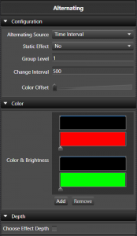
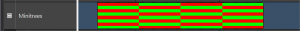

&nbsp;

The alternating effect does what it&#8217;s name implies. It automates the process of alternating elements between colors. A simple example is a row of mini trees alternating back and forth from red to green.

&nbsp;

&nbsp;

### Configuration

The static effect option allows you to specify if the effect actually changes back and forth between colors over the duration of the effect or just sets up an alternating color pattern that is the same over the duration of the effect. This can be easily used to set alternating color patterns without having to use a pulse on all the individual elements. An example of this is the American flag that has red and white bars alternating, but are the same color for the length of the flag.

Group level specifies how many elements are of the same color before switching to the next color in the list. In the case of pixels with color of red and white set, if you set it to 5, there will be 5 lights that are red and then 5 that are green and then 5 more red and back to green and so on. This works for non pixel elements as well.

Change interval defines on a non static effect, how often the colors switch back and forth. It is specified in ms. So if you want the colors to switch back and forth every 500 ms, set it to 500.

Color offset specifies how many colors to jump when the alternating pattern starts over. This can create interesting marquee style effects.

### Mark Collections

Switching the Alternating Source to Mark Collection allows the switching between colors based on individual Marks within the selected Mark Collection. A video is included at the bottom of the page to demostrate using Marks in the Alternating effect.

### Color

The alternating supports what we can a Color Gradient Level Pair. In this case the color and the brightness level work together. With this you can specify fading colors or any other combination. This works just like a pulse, only within that color portion of the alternating. Each color gradient has a curve to control it. You can add or remove these pairs of colors. Both the gradient and the curve support drag and drop.

### Effect Depth

This works as it does in some of the other effects and specifies at what level of grouping the effect is applied.

&nbsp;

### New in Vixen 3.5

In Vixen 3.5, support for aligning the alternate transitions to a mark collection has been added. This give more control over when the colors alternate.

[3]
