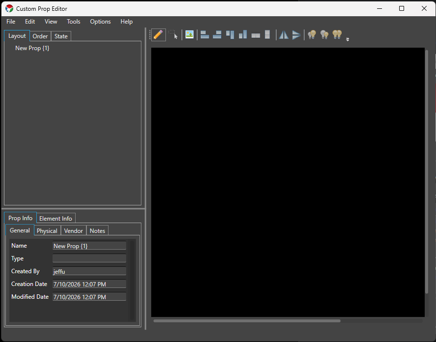
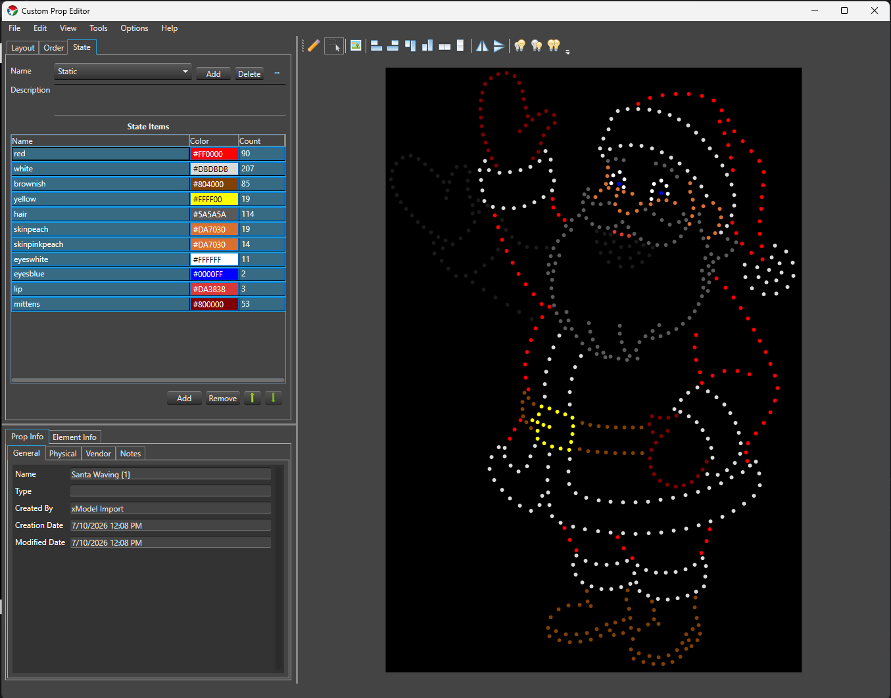

## Overview

The Custom Prop Editor is a replacement for the deprecated prop template mechanism, used to model props that don't fit the Preview's [Smart Objects]( "Smart Objects"). You can design almost any prop you want, share models with others, and import existing models from other sequencers.

### Launching

The Custom Prop Editor can be launched from multiple places, and offers the same features no matter which one you use:

* The main Admin screen, under **Tools -> Custom Prop Editor**.
* The Preview, under **View -> Prop Editor**, or the **Custom Prop Editor** toolbar button next to **Add Custom Prop** / **Custom Prop Library**.

---

### Window Layout

The editor window is split into four panes, plus a menu bar:

* **Menu bar** **File** (New, Open, Save, Save As, Import xModel, Exit), **Edit** (Cut, Copy, Paste), **View** (Assign Background, Background Opacity), **Tools** (Vendor Browser, Export Wire Diagram), **Options** (Preferences), and **Help** (View Help).
* **Element Tree** (top-left) Builds the Elements and Groups for the Prop, across three tabs: **Layout**, **Order**, and **State**. See [Element Tree](#element-tree) below.
* **Prop Info / Element Info** (bottom-left) Metadata about the whole Prop, or about whichever element is currently selected in the tree. See [Prop Info](#prop-info) and [Element Info](#element-info) below.
* **Drawing Canvas** (right) Where you place and arrange the lights that make up the Prop. This pane, and its toolbar, stay visible no matter which Element Tree tab is active. See [Drawing Canvas](#drawing-canvas) below.

A status bar at the bottom of the window shows the current mouse position over the canvas.

---

### Element Tree

#### Layout

The **Layout** tab shows the Prop's element hierarchy as a tree, similar to the tree used in Display Setup or Preview Setup. Double-click (or F2) a row to rename it inline.

Right-click a row for the context menu:

* **Create Empty Group** / **Copy to New Group** / **Move to New Group**
* **Cut** / **Copy** / **Paste** / **Paste as New**
* **Delete**
* **Rename**
* **Find/Replace Rename**

You can drag and drop rows to reorder them within a group or move them between groups (drop on a group to add to it). Groups of lights and groups of groups can't be mixed together in one drag, and lights can't be dropped directly on the root element. Holding **Ctrl** while dropping reverses the order of the items you're moving.

#### Order

The **Order** tab shows a flat list of every light in the Prop, sorted by its current render order, with that order number shown next to each name. This is the pixel/render order used elsewhere, such as wire diagram export. Drag and drop rows to reorder them — the whole list renumbers sequentially after a drop. Right-click for **Reverse** (reverses the order of the selected rows), **Rename**, and **Find/Replace Rename**.

#### State

Since Build 1449.

The **State** tab authors [State]( "State Property") definitions directly on the Prop, so they're already in place the moment you import the Prop into a Preview — no need to separately configure the State property in Display Setup afterward. It follows the same State Definition/State Item model as the State property, and mirrors its Setup dialog as closely as the Custom Prop Editor's layout allows.

* **Name** A drop-down of the Prop's State definitions, with **Add**, **Delete**, and a **...** menu for **Rename** and **Copy** — the same behavior as the State property's [State Definitions]( "State Definitions").
* **Description** A free-text field for the selected State definition.
* **State Items** A grid of the selected State definition's items — **Name** (inline editable), **Color** (double-click to open the color picker, or type a hex value directly), and **Count** (read-only, the number of assigned lights) — with **Add**, **Remove**, and **Move Up**/**Move Down** buttons below it, matching the State property's [State Items]( "State Items") grid.
* Validation problems, if any, are listed in red below the grid.

**Assigning lights is different here than in the State property.** There's no checkbox tree — instead, you assign lights by selecting exactly one State Item row and then working directly on the Drawing Canvas:

* Click an unassigned light to add it to the selected State Item; click an already-assigned light to remove it.
* Drag a selection box to add every light inside it to the selected State Item.
* Hold **Ctrl** while drag-selecting to remove every light inside the box from the selected State Item instead.

Canvas assignment only works when exactly one State Item row is selected. With zero or multiple rows selected, clicking or drag-selecting on the canvas does nothing to your assignments.

While the **State** tab is active, the Drawing Canvas itself switches into a live local preview: every light not covered by an active State Item dims to a near-black RGB (25, 25, 25) so the assigned lights stand out, and each assigned light shows its State Item's color.

* Selecting one State Item row previews only that row.
* Selecting multiple rows previews all of them at once — but canvas assignment editing is disabled while multiple rows are selected, since it wouldn't be clear which row you meant to edit.
* If a light is assigned to more than one active State Item with different colors, the preview shows the RGB average of those colors.

This preview is local to the editor — it never sends anything to Vixen Live Preview or other output. There's no separate preview on/off toggle; it's simply active whenever the **State** tab is.

Leaving the **State** tab (switching to **Layout** or **Order**) restores the canvas to its normal appearance and behavior.

---

### Drawing Canvas

The canvas toolbar has two mutually exclusive modes:

* **Draw mode** Click anywhere on the canvas to add a new light at that point, under whichever element is currently selected in the tree (or creates a new one).
* **Selection mode** Click a light to select it (**Ctrl**-click to add/remove from the selection), or drag a selection box over empty canvas to select every light fully inside it.

There's no dedicated tool for drawing a string, arc, or grid of lights in one action — you place lights individually in Draw mode, then use the arranging tools to line them up:

* **Align Left**, **Align Right**, **Align Top**, **Align Bottom**
* **Distribute Horizontal**, **Distribute Vertical**
* **Flip Horizontal**, **Flip Vertical**
* **Increase Light Size**, **Decrease Light Size**, **Match Light Size**

With two or more lights selected, resize handles appear on the selection's bounding box (corners and edges), along with a rotate handle above it. Dragging a resize handle scales the selected lights' positions and sizes relative to the opposite corner or edge — hold **Shift** to keep the scaling uniform. Dragging the rotate handle rotates the selection around its center — hold **Ctrl** to snap to 45° increments.

There's no zoom or snap-to-grid in the Custom Prop Editor canvas; pan using the scroll bars, and the canvas size matches the Prop's configured **Height**/**Width**.

**Assign Background** (View menu, or the toolbar button) sets a JPG/GIF/PNG image as a reference background for the canvas, useful for tracing a photo of the actual prop. **Background Opacity** (View menu) dims it. Selected lights can be removed with the **Delete** key, after a confirmation prompt (deleting a light removes it from every group it belongs to).

---

### Prop Info

Metadata about the whole Prop, across four sub-tabs:

* **General** **Name**, **Type** (a category like "Christmas", "Halloween", "General"), **Created By**, **Creation Date**, **Modified Date**.
* **Physical** **Material**, **Height**, **Width**, **Depth**, **Node Count**, **Bulb Type**, and **Color Mode** (**Full Color**, **Multiple Color**, **Single Color**, or **Other** — declares color handling for the whole Prop; if it mixes color modes, choose Other). This maps to color handling in Display Setup.
* **Vendor** **Name**, **Contact**, **Website**, **Email**, **Phone** — filled in automatically when you import a model through the [Vendor Browser](#vendor-browser).
* **Notes** A free-text field for anything else worth recording about the Prop.

---

### Element Info

Metadata about whichever element is currently selected in the **Layout** tab:

* **Name**
* **Face Component** and **Face Color** Associates this element with a face part (for example Eyes Open, Eyes Closed, or one of the LipSync phoneme codes) used by the [LipSync]( "LipSync") effect.
* **Model Type** Since Build 1449. Classifies the element's role for State authoring and Preview import: **None** (no special role — the default), **Model** (the primary element State definitions are authored against and where the State property is attached on import), **SubModel** (a submodel grouping), **FaceInfo** (imported or user-designated face information), or **StateInfo** (imported or user-designated legacy state grouping, from older xModel imports). At most one element in the Prop can be **Model**; setting a new one clears the previous choice. If no element is explicitly set to **Model**, the Prop's root element is treated as the model element for State authoring and Preview import.
* **Children** and **Lights** Read-only counts of this element's child elements and the lights beneath it.
* **Light Size** Read-only; shows `multiple sizes` if the lights beneath a group don't all share one size.

---

### Vendor Browser

**Tools -> Vendor Browser** opens the **Vendor Inventory** window, a way to browse and import props that vendors (or other users) have already built and published.

1. Choose a vendor from the **Vendor** drop-down.
2. Browse the category tree below it to find a Prop. The vendor controls how their categories are organized.
3. Clicking a Prop shows its details on the right: a preview image, a **Product Info** tab (type, material, dimensions, pixel count/description/spacing, notes), and — if a downloadable model is available — a **Model Options** tab listing each available model with a **Select** button.
4. Pressing **Select** downloads and opens that model in the Custom Prop Editor, and fills in any blank **Physical** and **Vendor** fields on the [Prop Info](#prop-info) tab from the vendor's listing.

From there you can edit the element tree, layout, or any other attribute to tailor the Prop to your needs, then save it as your own.

---

### Importing

**File -> Import xModel** imports an xLights `.xmodel` file — whether it stores its layout as `CustomModel` or the more compact `CustomModelCompressed`, the importer handles both automatically. Along with the light layout, an xModel import also brings in:

* `subModel` definitions, as elements with **Model Type** `SubModel`.
* `faceInfo` definitions, as elements with **Model Type** `FaceInfo`, for use with [LipSync]( "LipSync").
* `stateInfo` definitions, mapped directly into the [State](#state) tab as State definitions and State items.

Importing switches the canvas out of Draw mode into Selection mode automatically.

---

### Preferences

**Options -> Preferences** sets editor-wide defaults: **Light Color** and **Selected Color** (how lights look on the canvas normally and when selected), **State Preview Base Color** (the dimmed color used for non-active lights while the [State](#state) tab's local preview is active), and **Default Light Size** for newly placed lights. A **Defaults** button resets all of them.

---

### Tutorial

#### General Overview



#### Analog Strings



#### Duplicate Parts


