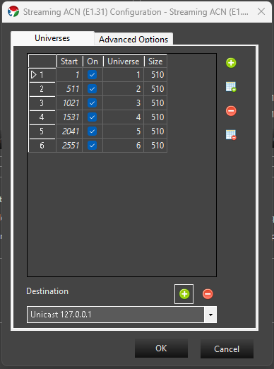
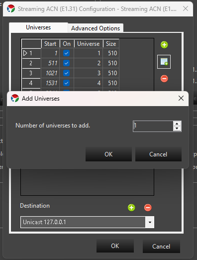
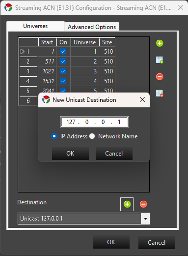
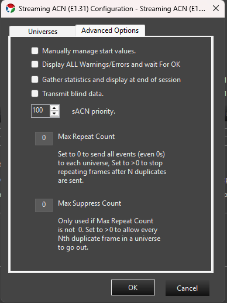

## Description

The Streaming ACN controller, commonly known as **E1.31** or **sACN**, is used to send DMX512 lighting data over an Ethernet network using the ANSI E1.31 protocol. It's one of the most widely supported protocols in the lighting world; nearly every modern pixel controller (Falcon, SanDevices, J1Sys, ESPixelStick, WLED, FPP based controllers, and many others) can receive E1.31.

Unlike simpler protocols such as [DDP][2], E1.31 is built around the concept of **universes**. A universe is a block of up to 512 DMX channels (slots) that is addressed and transmitted independently. A single E1.31 controller in Vixen can be configured with as many universes as you need, each mapped to a different range of the controller's output channels. This makes E1.31 well suited to large displays where your channel count exceeds the 512 channel limit of a single DMX universe - you simply add more universes rather than more controllers.

All of the universes configured on one E1.31 controller instance in Vixen are sent to a single destination - either **Multicast** (sent out a chosen network adapter, with each universe automatically going to its own multicast group per the E1.31 spec) or **Unicast** (sent directly to one IP address or hostname). If you need to send data to more than one physical destination, add a separate E1.31 controller for each destination.

## Setup

When you add a Streaming ACN (E1.31) controller in Vixen, you'll be prompted for the number of output channels, just like other controllers. Set this to the total number of channels across all the universes you plan to configure.

Right-click the controller and choose **Configure** to open the setup screen. It's split into two tabs: **Universes** and **Advanced Options**.

### Universes tab

The grid lists each universe configured on this controller:

- **Start** - the first output channel (1-based) in this Vixen controller that this universe's data is read from.
- **On** - whether the universe is active. Inactive universes are kept in the list but not transmitted.
- **Universe** - the E1.31 universe number, from 1 to 64000. Universe numbers must be unique within a controller.
- **Size** - the number of channels (slots) in this universe, from 1 to 512.

By default, Vixen automatically manages the **Start** column for you, laying universes out contiguously one after another as you add or resize them. If you need to control the start channel of each universe yourself - for example to leave gaps, or to match a specific order used by your hardware - check **Manually manage start values** on the Advanced Options tab. While automatic management is on, you can also click a column header to sort the grid (left-click for ascending, right-click for descending).

Use the buttons to the right of the grid to:

- **Add Universe** - add a single new universe, numbered one higher than the highest universe currently in the list.
- **Add Multiple Universes** - add a run of sequential universes in one step; you'll be prompted for how many to add.
- **Delete Universe** - remove the currently selected universe(s).
- **Delete All Universes** - clear the list and start over with a single default universe.

At the bottom of the tab, the **Destination** drop-down selects where this controller's E1.31 data is sent:

- **Multicast \<adapter name\>** entries are populated automatically from your machine's network adapters. Choosing one sends standard E1.31 multicast traffic out that adapter; every device on the network subscribed to a given universe's multicast group will receive it. Multicast destinations can't be removed since they come from your machine's network configuration.
- **Unicast \<address\>** entries send data directly to a single device. Click the **+** button next to the destination box to add one - you can enter either an IP address or a network/host name.

A unicast entry can be removed with the **-** button, as long as it isn't currently selected as the destination for another E1.31 controller instance in your setup.

### Advanced Options tab

- **Manually manage start values** - see the Universes tab description above.
- **Display ALL Warnings/Errors and wait for OK** - if checked, any warnings encountered when the controller starts (for example, a configured network adapter that no longer has an address) are shown in a dialog that must be dismissed before playback continues. When unchecked, these are silently ignored.
- **Gather statistics and display at end of session** - if checked, Vixen tracks the number of packets and slots sent per universe and shows a summary when the show stops.
- **Transmit blind data** - sets the *Preview_Data* flag defined by the E1.31 specification on outgoing packets, marking them as not intended for permanent effect.
- **sACN priority** - the E1.31 source priority (0-200, default 100) sent with every packet. This is only relevant if more than one E1.31 source is transmitting to the same universe; receivers that support priority arbitration use it to decide whose data wins.
- **Max Repeat Count** - by default (0) Vixen sends a packet for every frame of your sequence to every universe, even when the data hasn't changed since the last frame. Set this above 0 to have Vixen stop re-sending a universe's data once it has repeated unchanged for that many frames, which can reduce network traffic on large shows.
- **Max Suppress Count** - only used when Max Repeat Count is above 0. Set above 0 to let every Nth suppressed duplicate frame through anyway, which is useful if a receiver needs a periodic keep-alive packet even while your data isn't changing.

## Patching

Elements / Props are patched to this controller just like any other controller. Select the controller and when you patch, the selected elements will be patched to the next available channels. You can also select a range of channels and patch elements to those directly. See [Patching Controllers][1] for more information.

[1]: 
[2]: 
