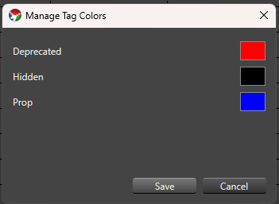

## Overview

Element Tags let you attach simple organizational or workflow labels to an element without renaming it, moving it in the Element Tree, or relying on notes kept outside of Vixen. This is useful for things like marking an element you're phasing out, tucking an element out of the way while you work, or flagging elements you plan to migrate to a physical prop later.

Vixen ships with three built-in tags:

- **Deprecated** (red dot by default) — marks an element you no longer want to actively sequence against. In the Sequencer, rows tagged Deprecated reject new effects, and opening a sequence that already has effects on a Deprecated element shows a warning listing the affected elements. See [Element Tags]() in the Sequencer section for details.
- **Hidden** (black dot by default) — marks an element you want to keep in your configuration but don't need to see or work with right now. In the Sequencer, Hidden elements can be toggled out of the row list for the current editing session.
- **Prop** (blue dot by default) — reserved for identifying elements intended for a future Prop migration workflow. It has no special behavior yet beyond being assignable and shown.

A tag applies only to the element it's assigned to — it is not automatically inherited by an element's children in a group.

Display Setup and Preview Setup share the same Element Tree control, so tagging works identically in both.

### Assigning and Removing Tags

Right-click one or more elements or groups in the Element Tree and choose **Tags** from the context menu. The submenu lists every tag currently in the catalog — today, the three built-in tags — with a checkmark next to any tag already assigned to your selection.

- Click an unchecked tag to assign it to every selected element.
- Click a checked tag to remove it from every selected element.
- If your selection is mixed — some elements have the tag, some don't — the checkmark appears as a muted, partial checkmark instead of a plain checkmark or no checkmark at all. Clicking a partial checkmark assigns the tag to the entire selection; only a fully-checked tag removes it from the entire selection when clicked.

Hold **Ctrl** while clicking a tag to apply the change to all children of the selected element(s) as well, not just the selected element(s) themselves. This most useful when deprecating elements to ensure all children are known to be deprecated as well.

### Tag Color Dots

Display Setup and Preview Setup never hide elements based on their tags — every element always stays visible in the tree, whether or not it's tagged. Instead, a tagged element shows a small colored dot after its name, one dot for each assigned tag that has a color, ordered left to right by the tag's sort order. For example, an element tagged both Deprecated and Hidden shows two dots side by side.

### Managing Tag Colors

Choose **Tags > Manage Tag Colors...** from the context menu to open the Element Tag Manager. It lists the built-in tags with a color swatch for each — click a swatch to choose a new color, then save. Color changes apply everywhere tags are shown: Display Setup, Preview Setup, and the Sequencer.

Tag assignments and any tag color changes made from Display Setup or Preview Setup are saved along with the rest of your changes when you save and close that editor, the same as any other edit made there.
