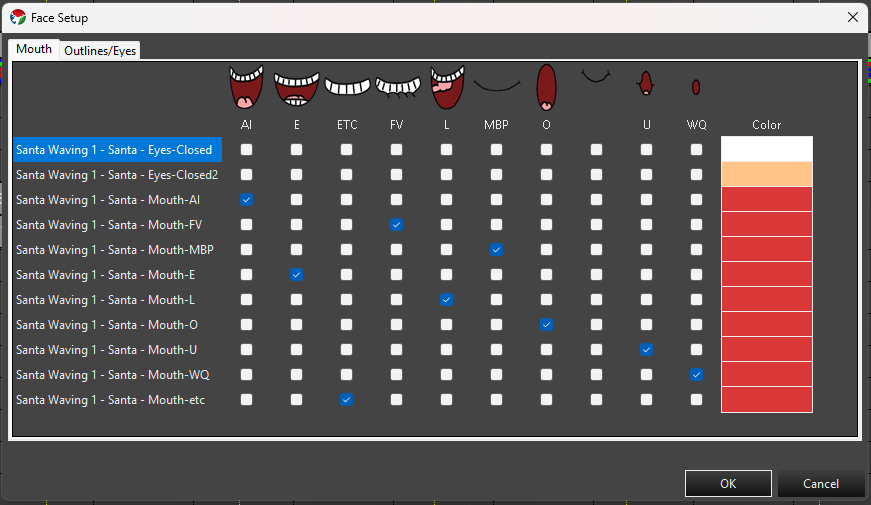
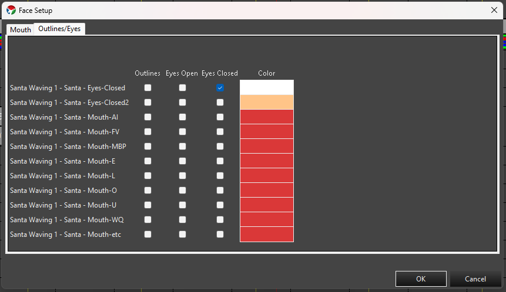
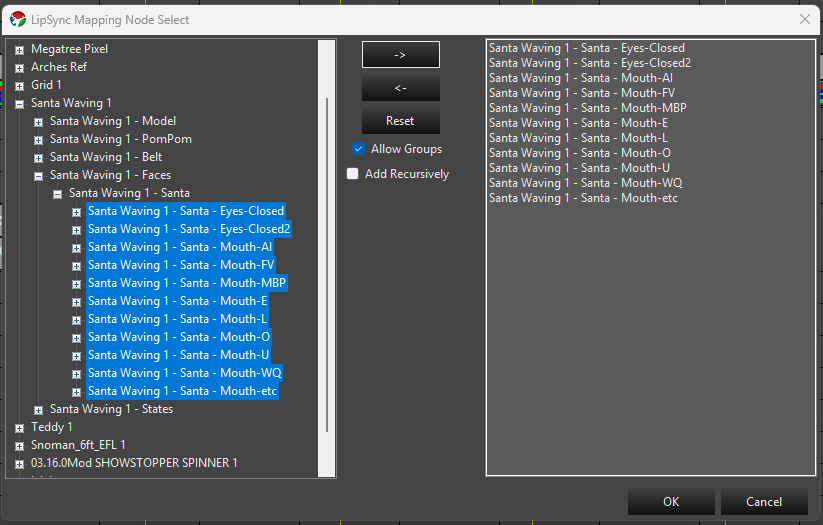

## Overview

The **Face** property lets you map individual elements to mouth phonemes and to the other parts of a singing face — eyes open, eyes closed, and outline — plus a color for each. It's the authoring side of a pair of features: once elements are mapped here, the [LipSync]( "LipSync") effect renders them in the Sequencer when its **Mapping Type** is set to **Face Mapping**. This is the same relationship the newer [State Property]( "State Property") has with the State effect, except Face is purpose-built for singing faces and their phoneme codes.

If you're using LipSync's **Image Mapping** type instead — drawing a mouth-shape image onto a pixel matrix rather than mapping individual elements — you don't need a Face property at all; see [Image Mapping](#image-mapping) below.

---

### Adding the Face Property

1. In Display Setup, select all of the individual elements that make up your face prop's mouth, eyes, and outline — every element that needs its own phoneme or component mapping. This is usually many leaf elements (individual pixels or segments), not a single parent group.
2. In the **Selected Item(s)/Configure** section, press **Add Properties**. In the **Select Item** dialog, choose **Face** and press **OK**. Every element in your selection gets its own Face property.
3. With **Face** selected in the Configure list, press **Configure**. Face provides its own setup wizard instead of a plain settings dialog, so this opens the **Face Setup** window directly, with one row for every element you selected.

---

### Face Setup Wizard

**Face Setup** has two tabs, each a grid with one row per element you selected, ending in a shared **Color** column — setting a color on one tab also updates it on the other, since it's really one color per element.

**Mouth**

One checkbox column per phoneme — **AI**, **E**, **ETC**, **FV**, **L**, **MBP**, **O**, **U**, **WQ**, and **REST** (the standard Preston Blair/Papagayo set). Check the phoneme(s) that row's element should light up for.

**Outlines/Eyes**

Checkbox columns for **Outlines**, **Eyes Open**, and **Eyes Closed**. Check the appropriate box(es) for that row's element.

* Click a checkbox cell to toggle it. You can select multiple cells first (click, Ctrl-click, Shift-click, or drag across a range) — clicking any one of the selected cells then toggles the whole selection together: if fewer than half of the selected cells are currently checked, the click checks all of them; otherwise it unchecks all of them.
* Double-click a **Color** cell to open a color picker for that row's element. If the target elements only support a fixed set of discrete colors, you get a picker limited to those choices; otherwise you get the full color picker. Multi-select several rows' Color cells first and double-click one to apply the same color to all of them at once.
* **OK** writes the checked phonemes/components and chosen color to each element's Face property. **Cancel** discards any changes made in the wizard.

---

### Editing from the Sequence Editor

You don't have to return to Display Setup to adjust face mapping. In the Sequence Editor, **Tools -> LipSync -> Edit Element Face Mapping** opens the **LipSync Mapping Node Select** dialog:

* Browse and select elements in the tree on the left, then press **->** to move them into the list on the right — multi-select first to move several at once. **<-** moves selected items back out of the list, and **Reset** clears it entirely.
* **Allow Groups** (checked by default) lets you move a group node itself into the list as a single entry, instead of restricting the list to individual leaf elements.
* **Add Recursively** expands a moved group into its individual descendant elements in the list, instead of keeping it as one group entry.
* Once the elements you want to map are in the list on the right, press **OK** to open the same **Face Setup** wizard described above, for that selection.

This is a faster way to fix or build out face mapping without leaving your sequence.

---

### Image Mapping

LipSync's other **Mapping Type**, **Image Mapping**, doesn't use the Face property or individual element mapping at all — it draws a phoneme image onto the target as if it were a pixel matrix, using shared image maps instead. Those maps are managed from the Sequence Editor via **Tools -> LipSync -> Edit Image Maps** and **Tools -> LipSync -> Default Image Map**. Full documentation for those tools is planned as a follow-up.

---

### Next Steps

Once your elements have Face properties configured, add a [LipSync]( "LipSync") effect targeting a group that contains them, with **Mapping Type** set to **Face Mapping**.
