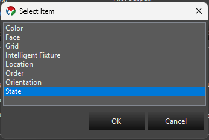
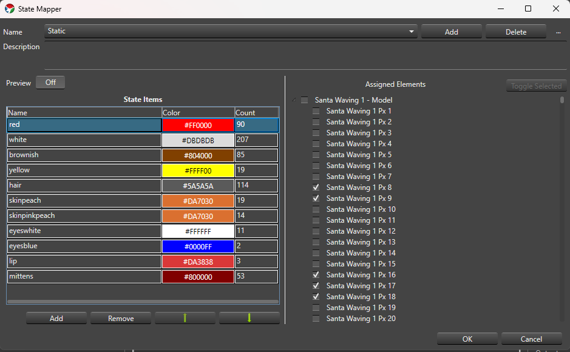
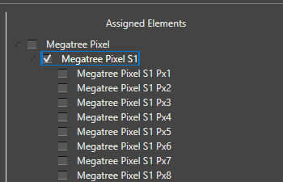
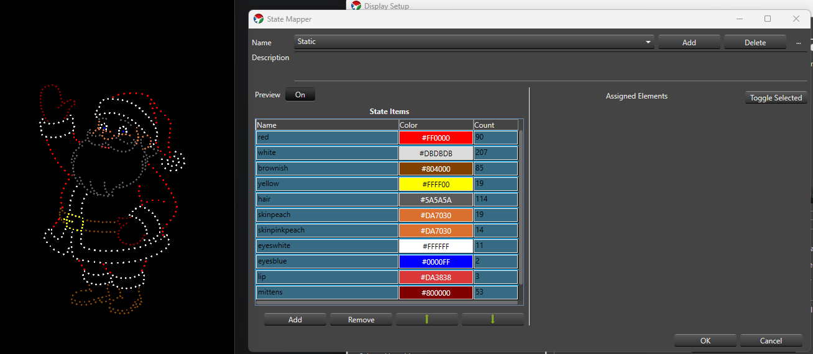

## Overview

Since Build 1449.

The **State** property lets you define one or more named State definitions for an element or group, each made up of State Items that map a color to a set of elements. It's the authoring side of a pair of features: once States are defined here, the [State]( "State") effect renders them in the Sequencer. This is the same relationship the existing **Face** property has with the LipSync effect, except State isn't limited to faces or phonemes — it works for any prop with parts that need to switch between named looks, like a waving arm, a lit sign, or a costume.

* A **State definition** is one named State, such as `Eyes Open` or `Arm Up`. It has a description and one or more State Items.
* A **State Item** is one row inside a State definition — a name, a color, and the set of elements it applies to. Giving two State Items the same name groups them so the effect can activate both together (for example, `Full Outfit` might be built from a red-coat State Item and a white-cuffs State Item, both named the same or targeted together as needed).

---

### Adding the State Property

1. In Display Setup, select the element or group you want to add States to. This should primarily always be the top level model group defining your Prop. Each Prop that needs State should generally only have one State Property.
2. In the **Selected Item(s)/Configure** section, press **Add Properties**. In the **Select Item** dialog, choose **State** and press **OK**.
3. With **State** selected in the Configure list, press **Configure** to open the State Property Setup dialog.

---

### State Definitions

At the top of the setup dialog:

* **Name** A drop-down of the State definitions on this property. The first one is selected automatically when the dialog opens.
* **Add** Prompts for a name (suggesting `State - 1`, `State - 2`, and so on) and creates a new State definition at the end of the list with one starter State Item named `State Item - 1`.
* **Delete** Confirms, then removes the selected State definition. You can't delete the last remaining State definition.
* **...** menu:
  * **Rename** Prompts for a new name without touching the definition's State Items or IDs.
  * **Copy** Prompts for a name (suggesting `<name> Copy`) and duplicates the selected definition, including its State Items, as an independent copy — later edits to either one don't affect the other.
* **Description** A free-text field below the name controls for describing what the State definition is for.

State definition names must be non-blank and unique. Names that differ only by case (`Open` vs. `open`) are allowed but show a non-blocking warning in case it was a typo. **OK** is disabled while any blocking validation error exists; **Cancel** and closing the window are always available and discard unsaved edits.

---

### State Items

The grid on the left side of the dialog lists the selected State definition's State Items:

* **Name** Click to edit inline. Required and trimmed of leading/trailing whitespace; duplicate names across rows are allowed (that's how you build a State Item Group).
* **Color** Double-click the cell to open the standard Vixen color chooser (or discrete-color chooser, if the assigned elements only support fixed colors). The cell shows the chosen color as its background with the hex value as text.
* **Count** Read-only — the number of leaf elements currently assigned to that row.

Below the grid:

* **Add** Adds a new row named `State Item - N`. If the property's elements are discrete-color and share at least one common color, the new row defaults to that color; otherwise it defaults to white.
* **Remove** Deletes the selected row(s), after confirming (the confirmation message says how many rows will be removed).
* **Move Up** / **Move Down** (the arrow icon buttons) Manually reorder the selected row one position at a time. These are only enabled when a single row is selected and it isn't already at that end of the list.

The grid also supports column-header sorting — click **Name**, **Color**, or **Count** to sort by that column. A sorted or manually reordered layout is remembered the next time you open this State definition. You can multi-select rows (standard click, Ctrl-click, Shift-click) to remove several at once or preview several at once — see [Preview](#preview) below.

---

### Assigned Elements

The tree on the right side shows the selected element and its children so you can choose which elements a State Item applies to. It's only shown and editable when **exactly one** State Item row is selected in the grid — select more than one row and the tree is empty, since assignments can only be edited one row at a time.

* Click a node to select it — this only highlights it, it doesn't change its assignment.
* Ctrl-click adds or removes individual nodes from the selection; Shift-click selects every visible node between the last-clicked node and the new one.
* Press **Space**, or click **Toggle Selected**, to toggle the checked (assigned) state of every currently selected node.
* Checking a group node clears and grays out its descendants — they're assumed included through the group. Unchecking the group re-enables the descendants without restoring whatever was individually checked before.

The **Count** column on the State Items grid updates as you check and uncheck elements.

---

### Preview

* **Preview** A simple **Off**/**On** toggle. It's off by default and, while off, nothing you do in the dialog affects your live output or preview.
* When **Preview** is **On**, whichever State Item row(s) are currently selected in the grid light up on the real output/preview using their configured colors. Selecting a different row (or set of rows) updates the preview immediately, and clearing the selection stops previewing anything.

* Editing a previewed row's assignments or color updates the preview live. Turning **Preview** off, or closing the dialog through **OK**, **Cancel**, or the window close button, always clears any active preview.

---

### Saving

**OK** saves your State definitions and closes the dialog; it stays disabled while a blocking validation error exists anywhere in the property. **Cancel**, or closing the window, discards any changes made in this session.

---

### Next Steps

Once an element has one or more State definitions, add a [State]( "State") effect to that element (or a parent group) in the Sequencer to render them.
