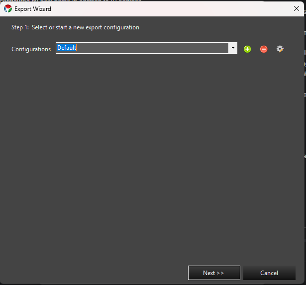
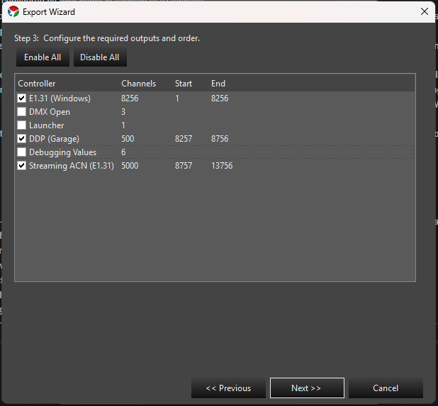
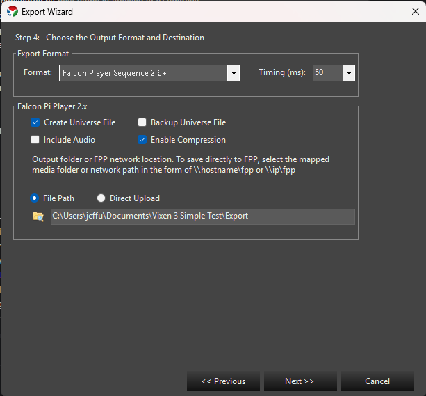
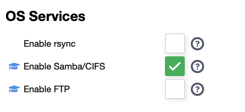
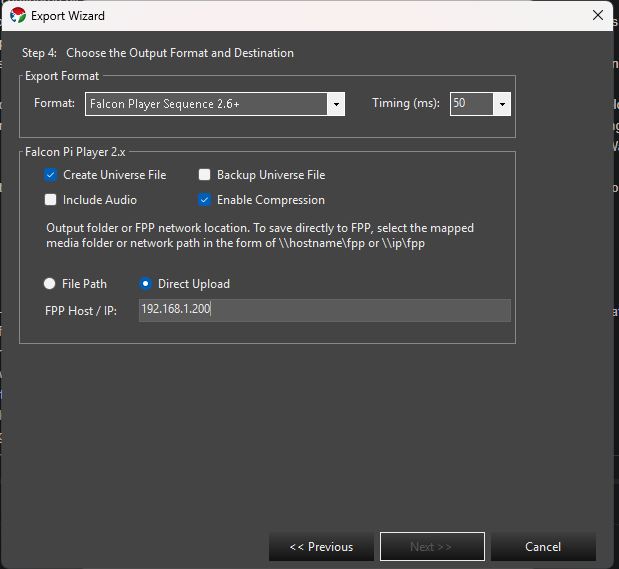
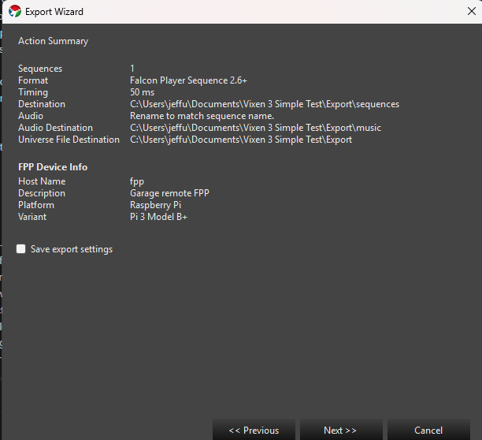

### Overview

The Falcon Player (FPP) is a lightweight, optimized, feature-rich sequence player designed to run on low-cost Single Board Computers (SBC). It was originally created to run on the $35 Raspberry Pi, hence the middle 'P' in the short name but now the FPP supports many more systems. It is still mostly commonly used on a Raspberry Pi (Zero, 2, 3, 4) or a Beagle Bone (Black, Green, Pocket).

The FPP shorthand is still used but it is now just called Falcon Player.

FPP aims to be controller agnostic, it can talk E1.31, DDP, DMX, Pixelnet, and Renard to hardware from multiple hardware vendors. Using various capes, FPP can also be a controller on P5 and P10 Matrixes, or strings of ws2811 pixels.

Useful Links:

- [FPP Documentation in Github](https://github.com/FalconChristmas/fpp/tree/master/docs/README.md)
- [Falcon Christmas forums](http://falconchristmas.com/forum/)
- [Falcon Player sub-forum](http://falconchristmas.com/forum/index.php/board,8.0.html)
- [Wiki](http://falconchristmas.com/wiki/index.php/Main_Page)
  
### Vixen Support

Vixen can export FSEQ files to be played on the FPP player or FPP based controller. There are two ways to export. Sequence at a time from within the [Sequencer][1] and via an Export Wizard that can export multiple sequences at a time.

### Export Wizard

The Export Wizard is the recommended way to export your sequences. It was added on to help automate the exporting of an entire show's worth of sequences instead of having to do them one at a time in the [Sequencer][1]. It can be started from the main Admin window under **Tools -> Export Wizard**.

#### Step 1: Select or Start a New Export Configuration

Every setting you configure in the wizard - the sequence list, controller order, output format, and destination - is stored together as a named **configuration** (profile) so you can re-run the same export again later without reconfiguring it.

This screen shows a **Configurations** drop-down. The first time you run the wizard it will contain a single *Default* profile. Use the **+** button to create a new named profile, the pencil/gear button to rename the currently selected one, or the **-** button to delete it. Choose the profile you want to use (or edit) from the drop-down and select next.

#### Step 2: Select Sequences to Export

The next screen will allow you to select or review the sequences to be exported. If you used a saved configuration, this will be pre-populated with the sequences used before. You can edit to add or remove to get the list of sequences you need.

- The folder icon opens a file picker (restricted to your profile's sequence folder) so you can browse and select the sequences you want to add.
- The second icon automatically adds every sequence found in the sequence folder for the current profile, excluding backup files.
- The delete icon removes any selected sequences from the list. You can also select rows and press **Delete**.

Once you have the sequences you need in the list, choose next.

#### Step 3: Configure the Required Outputs and Order

The next screen allows you to choose the controller blocks and the order they should be exported in. The check boxes on each controller determine if it is included in the export; **Enable All** / **Disable All** buttons let you toggle every controller at once, and **Ctrl+A** selects every row so you can drag a block of them together. You can drag and drop the controllers into any order desired. The channel ranges will be adjusted to match the new order.

This will need to directly match the intended setup in FPP. Vixen can export the controller config for use in FPP, so that can be automated - in that case the controller order is not really important, all that matters is that they match. If you are exporting from other sequencers, then you need to ensure they are configured the same. Once you have the proper controllers and order set, choose next.

#### Step 4: Choose the Output Format and Destination

The next screen is used to set up how the export is done.

- **Format** - Choose the output format. The default of Falcon Player Sequence 2.6+ should be used for modern versions of FPP. There are other options to support legacy versions as well as exporting to older Vixen 2 formats and CSV.
- **Timing (ms)** - The update interval (frame step time) baked into the exported file, in milliseconds. 25, 50, and 100 ms are offered by default, though a custom value can be typed in. This should match the update interval your controllers/sequence were designed around; a smaller value gives finer timing resolution at the cost of a larger file.

Once you have chosen a format, the section below it adapts to match. Formats other than Falcon Player Sequence 2.6+ show separate **Sequence** and **Audio** panels where you independently browse to an output folder for each (and, if the audio doesn't already sit alongside your sequences, optionally rename the audio file to match the sequence name). For **Falcon Player Sequence 2.6+**, a single **Falcon Pi Player 2.x** panel replaces both, with the following options:

- **Create Universe File** - Generates the universe configuration file that reflects the controller and channel mapping, in the exact format FPP uses.
- **Backup Universe File** - If the destination already has a universe file, it is renamed to a timestamped backup before the new one is written.
- **Include Audio** - Includes the audio file as part of the export, named to match the sequence file so FPP can locate it automatically.
- **Enable Compression** - Compresses the FSEQ file. This is enabled by default and recommended.

Below those options, choose how the files reach FPP - **File Path** or **Direct Upload**:

##### File Path

This is the original method, and works with any FPP version. Choose an output folder - it can be a plain local/network folder, or a mapped path directly into FPP's own storage in the form `\\hostname\fpp` or `\\ip\fpp`, using FPP's Samba/CIFS file sharing. Vixen creates the `sequences`, `music`, and `config` subfolders it needs underneath whichever folder you choose.

If you point this at FPP over the network, the export wizard can place all the files where they belong, including the universe file, sequences, and audio, in one pass. If you export to a local folder instead, the folder structure will mirror FPP's layout so you can upload the files yourself afterward.

Samba/CIFS sharing was enabled by default on FPP versions 5 and older, but on FPP 6+ it has to be turned on under **FPP Settings -> System**. You'll need advanced settings enabled under **FPP Settings -> UI -> User Interface Level** to see it; then under OS Settings, select **Enable Samba/CIFS**.

**Note:** Windows 11 has changed some security settings and will not allow you to mount an anonymous Samba share. The following has worked for several users. See [SMB Protocol Changes][2] for more info.

This can either be deactivated via group policy by activating Computer Configuration > Administrative Templates > Network > Lanman Workstation > Enable insecure guest logons

Or via Registry Editor by adding the following Key

HKEY_LOCAL_MACHINE\SOFTWARE\Policies\Microsoft\Windows\LanmanWorkstation with DWORD property AllowInsecureGuestAuth and the value 1

If you export via File Path directly to FPP, you will need to manually restart the FPPD daemon afterward to pick up any universe configuration changes.

##### Direct Upload

Direct Upload sends sequences, audio, and the universe file straight to FPP over its own web API, entirely avoiding Samba/CIFS and the Windows 11 issue above. Enter the FPP device's hostname or IP address in the **FPP Host / IP** field. Vixen pings the host as you leave the field to confirm it's reachable - you can't move to the next step until it responds. If a universe file is generated, FPPD is restarted automatically after the upload, so no manual restart is needed.

#### Step 5: Summary

The last screen details what will be done: sequence count, timing, format, output folder, audio handling, and (for Falcon Player Sequence 2.6+ with universe file generation) the universe file destination. If not all of the selected controllers support universes, a warning is shown here, since those controllers will be left out of the universe file and will need to be configured manually in FPP.

If you're using Direct Upload with the Falcon Player Sequence 2.6+ format, an **FPP Device Info** panel queries the device and displays its host name, description, platform, and variant - a quick way to confirm you're pointed at the right box before exporting.

Check **Save export settings** and enter (or choose an existing) configuration name to save these settings as a profile for future use. After you hit next, it will commence exporting, with progress bars showing progress through the process.

### Sequence Editor Export

Under **File -> Export** in the sequencer is the legacy export. It is very similar to the wizard, but much simpler in that it can only export the sequence you have open in the editor. You cannot save any settings in it either. This is retained for legacy purposes, but may be removed in the future, so the recommendation is to use the wizard.

[1]: 
[2]: <https://learn.microsoft.com/en-us/w...4h2#server-message-block-smb-protocol-changes>
