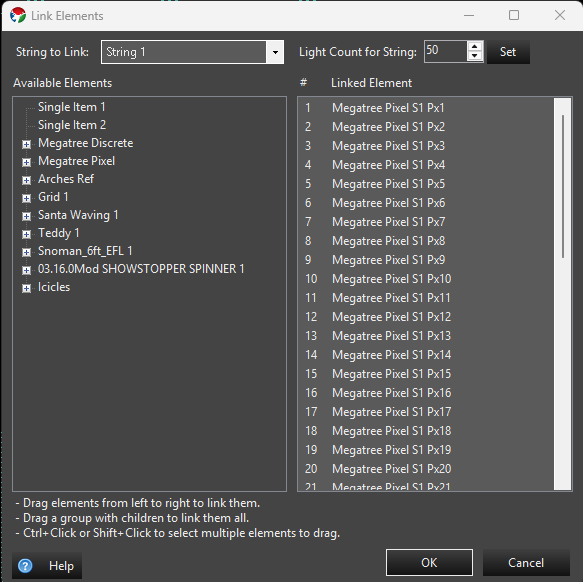

## Overview

Linking in the Preview is the act of assigning an Element to the light node that it represents. Much of this can be automated when adding Props to the Preview, but sometimes you may need to do it manually. In the Properties section of a Prop shape is an entry called Linked Elements that can be used to edit the linkage.

This is the same **Link Elements** dialog for every shape in the Preview — Basic Shapes, Smart Objects, and Custom Props all open it from their Linked Elements property, so the behavior described here applies no matter which prop you're linking.

### Usage Notes

* Some elements have multiple strings. Select the string to edit in the **String to Link** list.
* Selecting a Linked Element and then double-clicking on a single element in the tree will assign that element to the highlighted Linked Element.
* Selecting multiple elements in the Linked Elements list and then double-clicking a single element in the Available Elements tree will assign the double-clicked element to all the highlighted Linked Elements.
* Dragging and dropping a single element from the Available Elements to a linked element will assign that element to the item it was dropped on.
* Selecting multiple elements in the Available Elements tree and dropping them on a linked element will assign, in order, the elements from the tree to the elements in the Linked Elements.
* Dragging an element group from the Available Elements to the Linked Elements will assign them, in order, starting with the element that was the target of the drop in the Linked Elements list.
* Advanced: Right-clicking on an assigned element brings up a popup menu with three options:
  * **Copy to All Elements/All Strings** assigns that element to every linked element across every string.
  * **Copy to All Elements in This String** assigns it to every linked element in the currently selected string only.
  * **Reverse Element Linking in This String** reverses the order of the linked elements within the current string.
* For shapes that support resizing the string from this dialog (such as Icicles and Multi String), a **Light Count for String** field with a **Set** button appears, letting you add or remove pixels from the selected string without leaving the dialog.

### Video Tutorial


