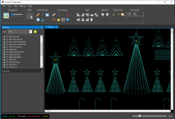
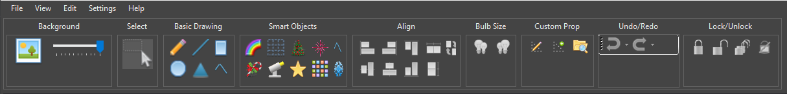
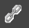
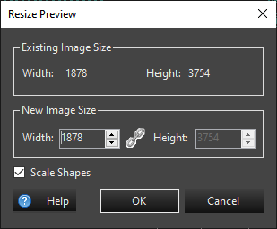
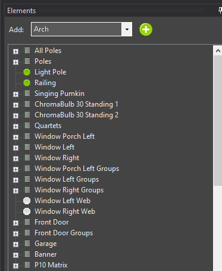
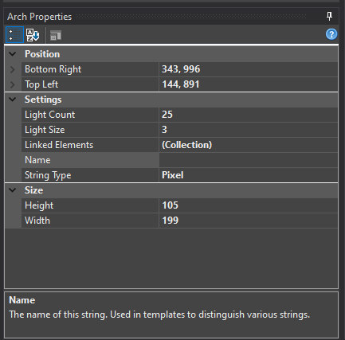

## Overview

The main preview screen is where the preview magic happens.

From the top, you can see the main menu bar. You'll practically never need this unless you prefer words instead of pictures.

On the left, top of this screen is the Elements Tree. This is a duplicate of the elements tree you use to setup the [Display Elements & Groups]( "Display Elements & Groups").

Below the Elements Tree are the properties for the currently selected display item.

And, on the right is the stage. This is where you will do all the work to setup your display preview. As you add items, you&#8217;ll do it in this area.

### Toolbar

The toolbar is used to tell the preview what you want to do. There are various groups in the toolbar.

### Background

To set the preview background, click the picture frame in the **Background** section of the toolbar.

The background image is usually a picture of your house that you use to define your lighting scene. Try to take the best shot you can looking directly your house. Stand way back and get the entire scene in a single picture - or stitch multiple pictures together. I would not recommend taking a panoramic picture as it tends to distort a lot toward the ends. You can try this, though, if you like.

#### Setting the Background Image

To set the background image, click on the picture icon in the preview editor toolbar (pictured above). This will bring up a standard Windows file selection dialog box. Most standard image formats are supported (JPG, GIF, PNG).

#### Background Image Intensity

Most lighting displays happen at night. You can use the slider next to the image toolbar button to set the intensity of the image on the screen. This can be changed at any time.

#### Resizing the Background Image

* From the **Edit** menu, select **Background Properties**
* Change the width. By default the height will adjust and keep the aspect ratio of the background image.
* Selecting the  button will toggle between keeping the aspect ratio of the width and height fixed vs allowing
  both the width and height to be edited independently.
* All items on the preview will re-size and move to new locations to match the new preview image

* By unselecting **Scale Shapes** the preview can be expanded to allow more space for props.  
  This type of resize is often desired when a background image is not being used.

  

### Select

Clicking this button puts the preview in selection mode. This cancels any other item you may have selected.

### Basic Drawing

The basic drawing tools group the simple drawing tools for easy access. See the [Basic Shapes]( "Basic Shapes") for more information on how to use these items.

### Smart Objects

The more complicated items are grouped in the Smart Objects area. These are props such as your Mega Tree and Stars. For more information see [Smart Objects]( "Smart Objects").

### Align

This section contains the tools for aligning and sizing preview objects to each other. The first preview shape you select is used as the reference for the alignment action. You need to select at least two preview shapes to use the alignment tools. Multiples can be selected with Ctrl Click, or the lasso selection. Alignment options include the following:

* Align Top - This will align the topmost edges of all selected shapes to the first shape selected.
* Align Bottom - This will align the bottommost edges of all selected shapes to the first shape selected.
* Align Left - This will align the leftmost edges of all selected shapes to the first shape selected.
* Align Right - This will align the rightmost edges of all selected shapes to the first shape selected.
* Distribute Horizontally - This will distribute the shapes evenly spaced between the leftmost and the rightmost shape.
* Distribute Vertically - This will distribute the shapes evenly spaced between the topmost and the bottommost shape.
* Match Properties - This will match similar properties on shapes like height and width.

### Bulb Size

The two buttons in this section increase or decrease the [Light Size]( "Light Size") of the currently selected item(s) without needing to type a value into the properties panel.

### Custom Prop

This section gives quick access to the [Custom Prop Editor]( "Custom Prop Editor"): one button launches the editor directly, and the other opens the folder where your custom prop library files are stored. You can also import a prop shared by someone else via **File -> Import Prop** in the main menu.

### Undo / Redo

Undo and Redo step backward and forward through your recent changes to the preview, such as adding, moving, resizing, or locking items. Each button also has a drop-down arrow that lets you jump back (or forward) multiple steps at once by picking an item from the history list.

### Lock, Unlock, and Hide Locked

Once you've finished positioning a prop, you can lock it in place so it can no longer be accidentally selected, moved, or resized while you keep working on the rest of your display.

* **Lock** - Locks the selected item(s). A locked item can still be clicked and unlocked, but cannot otherwise be selected, dragged, resized, or included in a lasso/marquee selection.
* **Unlock** - Unlocks the selected item(s).
* **Unlock All** - Unlocks every item in the preview, regardless of what is currently selected.
* **Hide Locked / Show Locked** - This single toggle button switches between hiding and showing locked items on the canvas. It's only enabled once at least one item is locked (or while hide mode is already on, so you can turn it back off). Turning it on makes every locked item disappear from the canvas entirely - it can't be seen, clicked, dragged, marquee-selected, or right-clicked, and its **Show Info** overlay (see below) is hidden too. This is handy for decluttering a dense layout: lock the props you've already finished, hide them, and edit only what's left as if the locked props weren't there.

  Locked items are never removed from the Element Tree or from your saved preview - hiding only affects what's drawn on this editing canvas. Locking a new item while hide mode is on hides it immediately, and unlocking a hidden item (including via **Unlock All**) brings it back immediately. Hide mode is a temporary view setting: it always starts back off when you reopen the preview, and it isn't part of the Undo/Redo history.

### Canvas Status Bar

Along the bottom edge of the editing canvas is a status bar with two parts.

* On the left, a color legend shows what each highlight color on the canvas means: *Linked*, *Selected*, *Un-Linked*, *Element Selected*, *Locked*, and *Pixel #1* (the first pixel of a selected pixel-based prop, useful for confirming its start point and direction).
* On the right, a zoom slider (25%-400%) with the current zoom percentage lets you zoom in for detail work or out to see your whole layout.

### Location Offset

When using location based effects, the locations of your props on the preview screen provides the spatial location information used by the effects. This allows for a wipe across several props in a group, or whole house wipes or many other effects. But there are times when your whole display doesn’t fit into one preview. Or it isn’t convenient to work on when it’s all in a single preview. You may want to have multiple preview to show different sections of your display, but you still want to apply a wipe effect across all of them. One example is if you are sequencing for multiple houses. Each house would have its own preview. Another example is if you have a front yard and side yard display. You may want each view on a separate preview.
The Location Offset function in the **Settings** menu allows you to specify the relationship of a preview instance with respect to others. It lets you offset the coordinates of all the props on the preview by a given amount. For the side by side multiple houses, or side yard, front yard examples, You would look at the leftmost preview, and determine it’s dimensions. In the Edit menu, click on Background Properties. Make note of the existing image size dimensions. Then close this preview configuration screen and open the configuration screen for the next preview. In the Settings menu, select “Location Offset Setup”. If you want this second preview to appear to the right of the previous one, enter the width of the previous preview into the horizontal box. For example, if you have two previews that are 1920×1080 in size. You would enter 1920 into the Horizontal offset in the second preview.

Two other options live in the **Settings** menu:

* **Keep Insert Mode Active** - Normally, drawing a shape or using a [Prop Wizard](#prop-wizards "Prop Wizards") returns you to selection mode afterward. Checking this keeps you in insert mode so you can place several copies of the same prop in a row without re-selecting the tool each time.
* **Use OpenGL Preview** - Switches the live preview viewer to use OpenGL rendering instead of GDI, which can improve performance on displays with a very large number of pixels. This is only available if your graphics hardware supports it; if it doesn't, Vixen will show a message and fall back to the standard GDI viewer.

### Help

The **Help** menu links to this documentation (**View Help**), the [Vixen YouTube channel](https://www.youtube.com/channel/UCsyABr1UByL5NG9DiGiXmpg), and dedicated help for the [Prop Wizard templates](#prop-wizards "Prop Wizards") (**Template Help**) and the [Custom Prop Editor]( "Custom Prop Editor") (**Custom Prop Help**).

### Close

When you're done editing this screen, click X button in the upper right or File -> Exit. Incremental changes may be saved using the File -> Save menu or Ctrl S. If you dod not save inside the preview you can save or cancel your changes in the [Previews Configuration]( "Previews Configuration"). If you made a huge mistake and want to lose your changes, click Cancel on the Previews Configuration dialog box and it will revert to the last saved change. That could be the save inside the preview, or to the last time you clicked OK in the Preview Configuration Dialog.

### Prop Wizards

Starting with Vixen 3.6, above the element tree is a drop down selector to add certain props that have wizards. This is similar to the same wizards in the Display Setup in that you can create the elements and the preview visual all in one step. You select the type of prop you want and then click the green + button to the right. You will be prompted by the wizard for the information needed to create it just like you would in Display Setup. Then once you fill in the info the preview visual will be created and automatically linked. You can then drag it around to position it where you wish. You can also drag the prop shape from the toolbar and it will also invoke the same wizrd as the template in the drop down.

### Element Tree

The Element Tree is the same tree used on the [Display Elements & Groups]( "Display Elements & Groups") screen. If you are using 3.6+, the best way is to create much of the setup in the preview. Most of the abilities to manipulate elements are available in the preview now. When using smart object or the templataes in the preview, it will walk you though setting up the color and dimming if desired. Patching and controllers are still managed in the Display Setup. If you are still using something older than 3.6, then you must start in the Display Setup and then link preview visuals to them. We highly recommend upgrading beyond 3.6 for the best experience. For the purposes of setting up elements, building a preview and then sequencing your display, you can skip the [Configure Controllers]( "Controllers") section.

If you already have the elements created, then you can add a preview visual with the following steps.

  1. Select a single element or group of elements in the Element Tree
  2. Click on a shape
  3. Draw the element on the preview main display

For more information have a look at the section on [Linking Elements]( "Linking Elements").

**Note:** Clicking on an element or group of elements in the element tree will highlight individual pixels, individual strings or entire items depending on what is clicked on in the tree

### Item Properties

Display items all have properties associated with them. Along with multiple common properties, some items have custom properties that can be set. See the [Basic Shapes]( "Basic Shapes") and [Smart Objects]( "Smart Objects") for more information on how to use these properties.

**View -> Prop Information** toggles an overlay that draws an outline around every prop on the canvas along with the Z position of its first pixel, which can help when working with props that use pixel depth.
