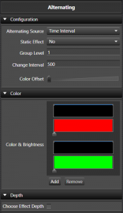
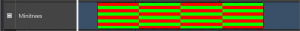
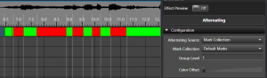

## Overview

The **Alternating** effect does what its name implies. It automates the process of alternating elements between colors. A simple example is a row of mini trees alternating back and forth from red to green.

## Configuration

* **Timing Source** This sets the source of how the alternating timing occurs.
  * **Time Interval** This sets the timing of the alternates to be based on a fixed interval of time. Selecting this reveals the **Static Effect**, **Change Interval**, and **Color Offset** options below.
  * **Mark Collection** Since Version 3.5. This sets the reference for the alternates to be based on the [Marks][5] in a Mark Collection. Selecting this reveals a **Mark Collection** picker in place of **Static Effect** and **Change Interval**; **Color Offset** still applies.
    * **Mark Collection** This allows you to choose the Mark Collection for the [Marks][5] to be used in aligning the alternates. The following is an example of being aligned to the Marks.

        
* **Static Effect** Only shown when the Timing Source is **Time Interval**. This option allows you to specify if the effect actually changes back and forth between colors over the duration of the effect or just sets up an alternating color pattern that is the same over the duration of the effect. This can be easily used to set alternating color patterns without having to use a pulse on all the individual elements. An example of this is the American flag that has red and white bars alternating, but are the same color for the length of the flag. Enabling this hides the **Change Interval** and **Color Offset** options, since there's no longer a change to time.
* **Group Level** Specifies how many elements are of the same color before switching to the next color in the list. In the case of pixels with color of red and white set, if you set it to 5, there will be 5 lights that are red and then 5 that are green and then 5 more red and back to green and so on. This works for non pixel elements as well. Range is 1-5000. The default is 1.
* **Change Interval** Only shown when **Static Effect** is disabled. Defines how often the colors switch back and forth, in milliseconds. So if you want the colors to switch back and forth every 500 ms, set it to 500. Range is 0-10000 ms. The default is 500.
* **Color Offset** Only shown when **Static Effect** is disabled. Specifies how many colors the starting color shifts by each time the colors switch (on every Change Interval, or every Mark when using a Mark Collection), rather than only once. With the default of 1, each switch advances every element's color by one position in the list, which is what produces the classic back-and-forth alternation. Larger values skip further ahead each switch, which can create a marquee-style effect where the pattern appears to march across the elements over time. Range is 1-10. The default is 1.

---

## Color

* **Gradients** This allows you to choose the color sets to be used. The alternating supports what we can a Color Gradient Level Pair. In this case the color and the brightness level work together. With this you can specify fading colors or any other combination. This works just like a pulse, only within that color portion of the alternating. Each [Color Gradient][3] has a [Curve][1] to control it. You can add or remove these pairs of colors. Both the [Color Gradient][3] and the [Curve][1] support drag and drop. See [Inline Curve Editor][2] and [Inline Gradient Editor][4].

---

## Depth

* **Levels Deep** When enabled it controls at what level the **Alternating** is applied inside a group of elements. So you can have 8 items and then have 4 of them grouped to the left and 4 grouped to the right. All of these are grouped under on group. By placing the **Alternating** at the top level group, you can **Alternating** all 8 of the items or the left and the right group as a pair.

---

## Tutorials



[1]: 
[2]: 
[3]: 
[4]: 
[5]:  "Marks"
