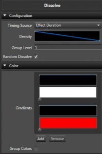

## Overview

The **Dissolve** effect simulates colors dissolving from, or filling into a space. The effect name of Dissolve may seem to suggest that it can only dissolve, but it also supports the opposite with filling color into an element. It has many settings to adjust how the effect behaves.

---

## Configuration

* **Timing Source** Controls if the effect is driven by the effect's time duration, or by [Marks][5] in a Mark Collection.
  * **Effect Duration** This is the default. The dissolve/fill progresses continuously across the whole length of the effect, following the **Density** curve.
  * **Mark Collection** Ties the dissolve/fill to [Marks][5] in a Mark Collection instead of the raw time duration. Selecting this reveals the **Mark Collection** picker and **Mark Type** option below.
    * **Mark Collection** Chooses which Mark Collection to align the dissolve/fill to.
    * **Mark Type** Controls how each Mark is used to drive the effect.
      * **Per Mark** The default. Each Mark-to-Mark interval behaves like its own small **Effect Duration** dissolve, following the **Density** curve within that interval.
      * **Per Mark Fill** Ignores **Density**. An even fraction of the elements is added at every Mark instead, so the prop fills up steadily, one Mark at a time.
      * **Per Mark Dissolve** The reverse of **Per Mark Fill** — an even fraction of the elements is removed at every Mark, so the prop empties out steadily, one Mark at a time.
      * **Mark Label Value - %** Reads each Mark's label text as a percentage (0-100) and sets the coverage of elements to match that percentage at that Mark, letting you drive the amount dissolved/filled directly from your Mark labels.
      * **Mark Label Value - Elements** The same idea as above, but the Mark's label text is read as an absolute count of elements/pixels to cover at that Mark, rather than a percentage.
* **Density** A [Curve][1] that governs how dense the coverage of the elements is over time, and how the dissolve itself acts. See the [Inline Curve Editor][2]. Only available when **Timing Source** is **Effect Duration**, or when it's **Mark Collection** with **Mark Type** set to **Per Mark** — the other Mark Type options control coverage directly and don't use this curve.
* **Group Level** Controls how many elements in the group have the same Dissolve applied to them. Range is 1-50000. Defaults to 1, meaning each element gets its own unique Dissolve. This (and the whole **Depth** section below) is hidden automatically when using **Mark Collection** timing with **Mark Type** set to **Per Mark Fill** or **Per Mark Dissolve** while **Color Per Step** is enabled — in that combination grouping is calculated automatically from the Marks instead.
* **Random Dissolve** Controls if the Dissolve pattern is random (checked) as to the order elements dissolve, or if the user can take more control. Enabled by default.
  * **Starting Element** Only shown when **Random Dissolve** is off. Starting location where the Dissolve or Fill will commence from. Range is 1-50000.
  * **Dissolve Flip** Only shown when **Random Dissolve** is off. Flips the direction of the sequential Dissolve.
  * **Both Directions** Only shown when **Random Dissolve** is off. Dissolves or Fills in both directions, one after the other.
    * **Directions Together** Only shown when **Both Directions** is also enabled. Dissolves or fills in both directions at the same time instead of one after the other.

---

## Color

* **Gradients** Sets the [Color Gradient][3] and intensity [Curve][1] for the effect. You can have more than one Gradient and each Gradient will have its own intensity [Curve][1]. See the [Inline Gradient Editor][4] and [Inline Curve Editor][2].
* **Color Per Step** When enabled, color will change for each step variation. When disabled, each step variation will have all colors.
* **Random Color Order** When enabled the colors will be chosen at random instead of in order.
* **Group Colors** When enabled, each element will have all colors generated in parallel, rather than a single color from the list.

---

## Depth

* **Effect Depth** Disabled by default. Enables grouping the target's elements by hierarchy depth instead of always treating every individual leaf element on its own. Enabling this reveals the **Levels Deep** option below.
* **Levels Deep** Only shown when **Effect Depth** is enabled. Controls at what level of the target's hierarchy the Dissolve is applied — so instead of clustering consecutive leaf elements together with **Group Level**, you can group along an existing prop hierarchy, letting each sub-group (e.g. each Arch in a group of Arches) dissolve or fill as one unit.

---

[1]: 
[2]: 
[3]: 
[4]: 
[5]: 
