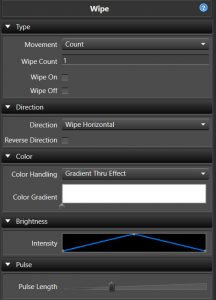

## Overview

The Wipe was one of the first location aware effects in Vixen. The goal of this effect is somewhat similar to the [Chase]( "Chase"), however it is aware of the position of the elements as defined in the Preview. It uses this location awareness to simulate a chase across all of its elements in a Wiping fashion.

### Behavior

Since Build 1448.

* **Across Elements/Groups** is the default behavior and is equivalent to how the effect has always acted. The Wipe collects every element under the target and calculates a single bounding area, so the wipe crosses the whole combined target as one pass.

* **Each Element/Group** applies an independent Wipe to each child element or group instead of combining them into a single pass. Each child gets its own local bounding area, so the Wipe restarts for every group. This is useful for applying the same Wipe to, say, each Arch in a group rather than wiping across all the Arches together.

  The **Behavior** section, and the **Depth** section below, only appear when the target has enough levels in its hierarchy for this choice to matter, or when more than one element/group is targeted. If only a single target with a shallow hierarchy is selected, Wipe always behaves as **Across Elements/Groups**.

---

### Type

* **Movement** This sets the source of timing for the wipe.
  * **Count** This sets the number of wipe passes in the timespan of the effect.
    * **Wipe Count** The number of wipes.
    * **Wipe On** When enabled, the wipe will maintain the elements in the on state as the wipe moves across.
    * **Wipe Off** When enabled, the wipe will start out on and wipe off across the prop.
  * **Pulse Length** This controls the wipe by a measure of the pulse length.
    * **Duration** Sets the length of each pulse in milliseconds.
  * **Movement** This controls the wipe by the [Movement](#direction "Movement Curve") curve instead of a fixed count or duration.

The Wipe on/off options are similar to the [Chase]( "Chase") extend to start/end options. These are most useful for wiping the stage on or off. The pulses have the same rules as the [Chase]( "Chase") and need to have a > zero end value for wiping on and a > zero start value for wiping off. The default pulse curve has a zero start and end value, so to use this you would need to adjust to a ramp on for the wipe on case or ramp off for wipe off as an example. **Wipe Count**, **Wipe On**, and **Wipe Off** are only available when **Movement** is set to **Count**.

---

### Direction

* **Direction** It can move in a number of directions: horizontal, vertical, diagonal up, diagonal down, burst, circle burst and diamond burst.
* **Reverse Direction** When enabled, the direction will be reversed. Only available when the **Type** **Movement** is set to **Count** or **Pulse Length**.
* **Movement** When the **Type** **Movement** is set to **Movement**, this [Curve]( "Curves") controls how the wipe progresses across the elements over time, allowing non-linear motion instead of a constant pace. See [Inline Curve Editor]( "Inline Curve Editor").

---

### Movement

* **X Offset** Shifts the center point of the effect along the X axis. Only available for the **Burst**, **Circle Burst**, and **Diamond Burst** directions, and may not work in all cases.
* **Y Offset** Shifts the center point of the effect along the Y axis. Only available for the **Burst**, **Circle Burst**, and **Diamond Burst** directions, and may not work in all cases.

---

### Color

* **Color Handling** This controls how the [Color Gradient]( "Color Gradients") is applied across the wipe. Unlike some other effects, Wipe has no single/static color mode — it always applies a gradient, just in one of the two ways below. See [Inline Gradient Editor]( "Inline Gradient Editor"). Only available when the **Type** **Movement** is set to **Count** or **Pulse Length** — in **Movement** mode the gradient is always applied across the whole effect, and the **Reverse** setting below is used instead.
  * **Gradient Thru Effect** This will transition the colors on the **Wipe** over time to match the colors in the gradient. This allows you to have a **Wipe** that goes from say red to blue over the duration.
  * **Gradient Across Items** The gradient will be applied proportionately over the group of items that the **Wipe** covers, with each item receiving the color within the gradient that corresponds to its percentage of the entire group.
    * **Color Per Count** When enabled with **Gradient Across Items**, spreads the color gradient across each individual pass (count) instead of across the full length of the effect.
* **Color Gradient** Sets the [Color Gradient]( "Color Gradients") to be used. See [Inline Gradient Editor]( "Inline Gradient Editor").
* **Reverse** When the **Type** **Movement** is set to **Movement**, this reverses the color and [Curve]( "Curves") depending on the direction the movement curve is heading, instead of following the **Reverse Direction** setting.

---

### Brightness

* **Intensity** This sets the [Curve]( "Curves") that controls the intensity of the color over the effect. See [Inline Curve Editor]( "Inline Curve Editor").

### Pulse

* **Pulse Length** The pulse length is also similar to the pulse overlap feature of the [Chase]( "Chase") and allows for the pulses to be adjusted to smooth out the Wipe or lengthen the amount of visible time any part of the lights are lit. Available when the **Type** **Movement** is set to **Count** or **Movement**.

---

### Depth

Since Build 1448.

* **Levels Deep** Only available when **Behavior** is set to **Each Element/Group** and a single target is selected. Controls at what level of the target's hierarchy each independent Wipe is applied. Depth choices that would simply resolve to individual leaf elements are excluded from the list since they aren't useful for this effect. When more than one element/group is targeted, each selected target is treated as its own independent group and this setting doesn't apply.
