---

## Overview

Creates an effect that displays text on the display element.
The text can appear in any font. It can be static or moving.

---

### String Setup

* **Positioning** - Determines how the target elements are treated.  Either as individual strings or by their actual location in the display preview.
                      Locations is often referred to as whole house, but it can be any form of multiple props.
                      Generally you want Strings when applying to one prop and locations if the target is multiple props.
  
* **Orientation** - Controls the orientation of the display area (matrix).

---

### Configuration

* **Text Trigger** - Controls how the text is triggered to be displayed.
  * _None_ - Uses standard text with no trigger. The text is animated using **Direction** and **Iterations**, and **Text Layout** becomes available.
  * _Mark Collection_ - Uses marks to trigger when each word is shown, taken in order from **Text Line(s)**.
  * _Mark Collection - Labels_ - Uses marks to trigger when each word is shown, using the mark's own label as the word text instead of **Text Line(s)**.

* **Mark Collection** - Selects the Mark Collection used to determine when words are displayed. Only shown when **Text Trigger** is set to _Mark Collection_ or _Mark Collection - Labels_.

* **Text Duration** - Adjusts how long each word stays visible: _Auto Fit_, _Mark duration_, or _User defined_. Only shown when **Text Trigger** is not _None_.

* **Text Fade** - Fades each word in or out as it is displayed, choosing between _None_, _In_, _Out_, _In/Out_. Only shown when **Text Trigger** is not _None_.

* **Direction** - The direction the text moves: _Left_, _Right_, _Up_, _Down_, _Rotate_, _None_, _Explode_, or _Fall_.
                   Your choice here determines which options are available under **Movement** below - each of _Rotate_, _Explode_, and _Fall_ unlocks its own dedicated movement curve (**Angle**, **Explode Position**, and **Fall Speed**, respectively), and _Left_/_Right_/_Up_/_Down_ unlock **Iterations**, **Center Stop**, and **End Stop**.

  _Left_, _Right_, _Up_, and _Down_ all share the same panel layout (shown here for _Left_):

  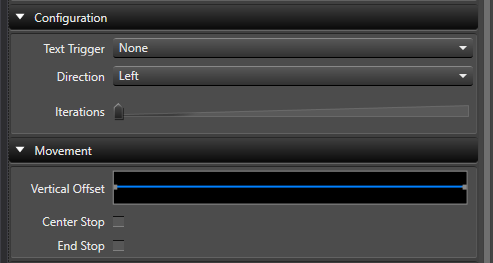

* **Iterations** - The number of times the pattern repeats over the duration of the effect. Only available when **Direction** is _Left_, _Right_, _Up_, or _Down_, and is hidden when **Direction Per Word** is enabled.

* **Time Visible Length (ms)** - Shows each word for the selected period of time up until the next word. Only shown when **Text Trigger** is not _None_ and **Text Duration** is set to _User defined_.

* **Repeat Text** - When enabled will repeat the individual words if there are more Marks in the collection than the number of total words. Only shown when **Text Trigger** is set to _Mark Collection_.

* **Direction Per Word** - When enabled will move the text based on **Direction** over the duration of each displayed word, rather than moving the text as a whole. Only available when **Text Trigger** is not _None_ and **Direction** is _Left_, _Right_, _Up_, or _Down_.

---

### Movement

* **Vertical Offset** - The vertical offset to help position text vertically on the grid. Hidden when **Direction** is _Up_ or _Down_, since the vertical position is already being driven by that movement.

* **Horizontal Offset** - The horizontal offset to help position text horizontally on the grid. Hidden when **Direction** is _Left_ or _Right_, since the horizontal position is already being driven by that movement.

* **Angle** - Controls the rotation angle of the text over the duration of the effect. Only shown when **Direction** is set to _Rotate_.

  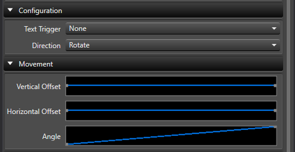

* **Explode Position** - Adjusts how far each character spreads from the center point over the duration of the effect. Only shown when **Direction** is set to _Explode_.

  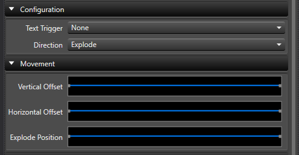

* **Fall Speed** - Adjusts the speed at which characters fall over the duration of the effect. Only shown when **Direction** is set to _Fall_.

  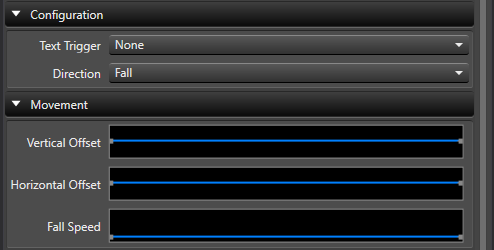

* **Center Stop** - When enabled, moves the text into view and stops it at the center. Only available when **Direction** is _Left_, _Right_, _Up_, or _Down_. Mutually exclusive with **End Stop** - enabling one disables the other.

* **End Stop** - When enabled, moves the text into view and stops it at the end of its travel instead of continuing off the grid. Only available when **Direction** is _Left_, _Right_, _Up_, or _Down_. Mutually exclusive with **Center Stop** - enabling one disables the other.

---

### Color

* **Text Color Gradients** - One or more colors or gradients to be applied to the text. One color will be applied to each line of text.

* **Cycle Color** - When enabled, cycles the text through the configured **Text Color Gradients** instead of applying them once per line.

* **Cycle Mode** - Selects whether **Cycle Color** advances per _Character_ or per _Word_ (including words displayed from a Mark Collection). Only shown when **Cycle Color** is enabled.

* **Gradient Mode** - Specifies how gradients will be applied to the text. There are 8 combinations of direction and how it's applied.
The gradient can be applied across the letters of the text, or across the whole element group.
If it is across the letters, the gradient will stay with the text.
If it is across the element, it will appear that the text travels through the colors of the gradient.

  The examples below all use the same **Text Color Gradients** setting - a red-to-blue gradient:

  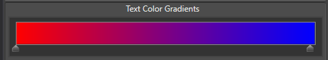

  | Mode | Across Text | Across Element |
  |---|---|---|
  | Straight | 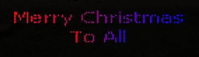 | 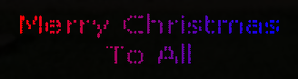 |
  | Vertical | 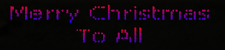 | 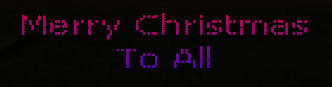 |
  | Diagonal | 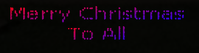 | 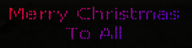 |
  | Reverse Diagonal | 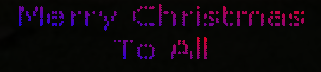 | 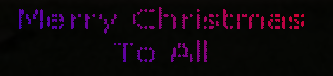 |

* **Use Base Color** - If selected, allows you to select a background color to appear behind the text.

* **Base Color** - The color to use for the background. Only shown when **Use Base Color** is enabled.

---

### Text

* **Text Line(s)** - One or more lines of text to display. Hidden when **Text Trigger** is set to _Mark Collection - Labels_, since the displayed text comes from the mark labels instead.
                     Blank rows (empty, or containing only spaces or tabs) are treated as a single space when rendering, so they take up one line of vertical space rather than being collapsed or ignored.
                     This lets you add blank rows above, below, or between lines of text to control spacing. This behavior applies to normal text and does not apply when **Text Trigger** is set to a Mark Collection option.

* **Font** - Specifies the font, style and size to be used. You may use any font installed on the PC. Note that the fonts used must be installed on any PC where you will transfer this sequence.

* **Font Scale** - Adjusts the size of the font over the duration of the effect, letting the text grow or shrink independently of the **Font** size itself.

* **Center Text** - Centers each line of text instead of left-justifying it.

* **Text Layout** - The orientation of the letters. When _Normal_, the text appears normally. When set to _Stacked_, the letters are stacked vertically. Only shown when **Text Trigger** is set to _None_.

### Brightness

* **Intensity** - The overall brightness envelope for the text itself over the duration of the effect.

* **Base Color Intensity** - The overall brightness envelope for the background color over the duration of the effect. Only shown when **Use Base Color** is enabled.

#### Video Tutorial




