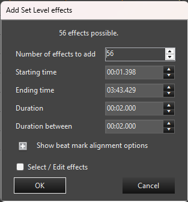
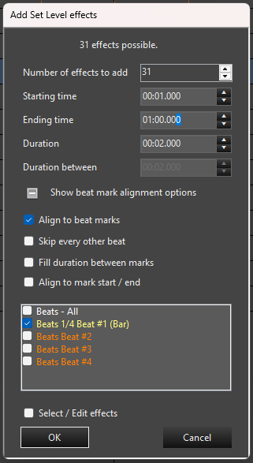

## Overview

Effects are normally added to the [Timeline][1] one at a time. The Add Multiple Effects feature lets you add many copies of the same effect to a single element in one step. The effects can be spaced out evenly by time, or they can be placed on the beats of a sequence using [Marks][2]. Each effect is created with the default settings for that effect type, so you can then adjust them in the [Effect Editor][3].

## Opening the Form

1. Right click on the [Timeline][1] in the row of the element you want the effects added to, at the time where you want them to start.
2. Choose **Add Effects** to show the list of effects.
3. Hold the **Shift** key while clicking the effect you want to add.

The **Add Multiple Effects** form opens, with the name of the chosen effect in the title bar. All of the effects added are placed on the row you right clicked on.

Vixen remembers the settings you last used with this form for the sequence. Because the form is opened by holding Shift, it will normally be pre-filled with those last used values. This makes it quick to repeat or fine tune what you did before. If there are no previous settings, the form starts with 2 effects, each 2 seconds long with 2 seconds between them.

## Timing Options

The top of the form controls the basic placement of the effects when you are not aligning to marks. The text at the top of the form, *n effects possible*, shows how many effects fit in the current settings.

**Number of effects to add**
: How many effects will be created. The form calculates the maximum that will fit in the time range and shows it below this box as *n effects possible*. This box is limited to that maximum. Double clicking the *n effects possible* text sets the number of effects to the maximum. The count must be greater than zero.

**Starting time**
: The time the first effect will start. This defaults to the start of the last selected play range if there is one, otherwise the time where you right clicked. Each following effect starts after the previous one ends, plus the *Duration between*.

**Ending time**
: The time by which all the effects must be finished. This defaults to the end of the last selected play range if there is one, otherwise the end of the sequence. Effects will not be placed past this time, and it is used to calculate how many effects are possible.

**Duration**
: The length of each effect. The minimum is 10 milliseconds.

**Duration between**
: The gap of time left between the end of one effect and the start of the next. Set this to zero to have the effects placed end to end.

All of the time fields use the format minutes:seconds.milliseconds (for example `0:02.000`). Changing the starting time, ending time, duration or duration between recalculates the number of effects possible.

## Beat Mark Alignment Options

Effects can be placed on [Marks][2] instead of at fixed time intervals. Click the plus icon next to **Show beat mark alignment options** to reveal these options, and the minus icon to hide them again. The panel is hidden by default, but any options that are checked remain in effect while it is hidden.

**Align to beat marks**
: Turns on mark alignment. When checked, one effect is started at each mark in the collections you have selected, beginning at the *Starting time*. The *Duration between* field is disabled because the marks now control the spacing. A list of your Mark Collections appears so you can choose which ones to use. The three options below it and the mark collection list are only available when this is checked.

**Skip every other beat**
: Places an effect on the first mark, skips the second, places one on the third, and so on. This is useful when the marks are very close together, or when you want an effect on every second beat. The number of effects possible is roughly halved.

**Fill duration between marks**
: Each effect is stretched from its mark to the next mark, so the effects fill all of the time between marks with no gaps. The *Duration* field is disabled since the effect length comes from the marks. Because the last mark has no following mark to fill to, one less effect is possible than the number of marks.

**Align to mark start / end**
: Each effect is given the start time **and** the duration of the mark it is placed on. This works well with marks that have meaningful lengths, such as those on a [Marks Bar][4] for lip syncing. The *Duration* field is disabled when this is checked.

*Fill duration between marks* and *Align to mark start / end* cannot be used at the same time. Checking one will disable the other. If neither is checked, the *Duration* you entered is used for every effect, starting at each mark.

**Mark collection list**
: Check one or more of the [Mark Collections][2] to use. Each collection is shown in its own color. Marks from all checked collections are combined and sorted by time. The number of effects possible is the number of marks that fall between the starting and ending times. Only collections that have a name are listed. If more than one collection has the same name, Vixen warns you that the results may not be as expected, so give your collections unique names.

## Finishing Up

At the bottom of the form is one more option, followed by the buttons.

**Select / Edit effects**
: When checked, the newly added effects are selected on the Timeline when the form closes. This makes it easy to immediately edit them as a group, or move them.

Click **OK** to add the effects. They are all added as a single action, so a single **Undo** removes all of them at once. Click **Cancel** to close the form without adding anything.

If the number of effects you request would run past the ending time, Vixen warns that at least one effect would be placed beyond the sequence length and asks whether you want to proceed anyway. If you proceed, effects that do not fit are not added.

OK is unavailable when no effects are possible, for example when no marks fall within the time range, or the duration does not fit between the start and end times. In that case, adjust the time range, duration or selected mark collections.

## Tips

- Set a play range on the [Timeline][1] before opening the form to have the starting and ending times filled in for you.
- To quickly line effects up with a song, [add marks][5] on the beats first, then use **Align to beat marks** together with **Fill duration between marks**.
- Effects are added with default settings. Select them (use **Select / Edit effects**) and change them together in the [Effect Editor][3].

 [1]: 
 [2]: 
 [3]: 
 [4]: 
 [5]: 
