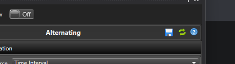
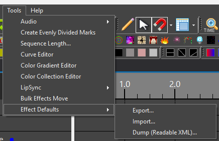

## Overview

Every effect (Pulse, Wave, Fireworks, Text, and so on) normally starts with Vixen's built-in look — for example, Pulse starts with a plain white gradient and a ramp-up curve. If you like to reuse a particular color gradient, curve shape, or other setting every time you place a certain effect, you don't have to reconfigure it by hand each time. Effect Defaults let you save your own starting point for each effect type.

In the effect editor header, next to the existing help (`?`) button, there are two buttons for this feature:

* **Save as Default** (floppy disk icon) — captures every setting currently shown for the effect you're editing and saves it as the default for that effect type.
* **Reset to Built-in** (circular arrow icon) — deletes the saved default for that effect type, after asking you to confirm. Future new effects of that type go back to Vixen's original built-in look.

Once you've saved a default for an effect type, every new instance of that effect type starts pre-filled with your saved settings instead of the built-in ones — no matter how you create it: drawing it on the timeline, using "Add Multiple Effects," adding it at marks, dragging it from the toolbox, a hotkey, replacing another effect with it, or dropping a compatible media file onto the timeline.

Clicking **Reset to Built-in** never changes the effect you currently have open — it only affects effects you create afterward.

## A quick example

1. Add a Pulse effect to the timeline and open it in the effect editor. It starts out with the built-in ramp curve and white gradient.
2. Change the curve shape and pick a different color gradient.
3. Click **Save as Default**. The **Reset to Built-in** button becomes enabled, confirming the save worked.
4. Add a brand-new Pulse effect anywhere on the timeline — it already shows your custom curve and gradient.
5. Click **Reset to Built-in** on any Pulse effect, confirm the prompt, and the next new Pulse effect you add goes back to the original built-in look.

## Where defaults are stored

Saved defaults belong to your current Vixen profile — the same profile that holds your controllers, sequences, and preferences. If you use more than one profile, each one has its own independent set of saved effect defaults.

## What is and isn't carried into a saved default

Saving a default captures every setting shown in the effect's property grid — colors, curves, gradients, numeric settings, and so on.

A few things are deliberately **not** carried over, because they only make sense within the specific sequence you were working in when you saved the default:

* **Mark Collection selections.** If an effect (such as Alternating or LipSync) is set to follow a specific Mark Collection, that particular selection is not saved as part of the default, since a Mark Collection from one sequence has no meaning in another sequence. New effects created from the default simply start with no Mark Collection selected for that setting.
* **Placement information**, such as which elements the effect targets, its position and duration on the timeline, and any attached media file — these always come from wherever you actually place the new effect.

If the curve or color gradient you had selected when you saved the default came from the [Curve][1] or [Color Gradient][2] library, the saved default keeps that library link live. That means if you later edit the shared library curve or gradient, every new effect created from that saved default picks up your edit automatically — the same way any other effect linked to that library entry would. If you ever delete or rename that library entry instead, effects created from the default keep working using the gradient's or curve's last-known values rather than breaking.

## Sharing defaults between profiles

Under **Tools → Effect Defaults** in the Timed Sequence Editor's menu, you'll find:

* **Export...** — opens a checklist of your currently saved effect defaults so you can pick which ones to save to a file. Use this to back them up or share a "look" with another Vixen installation or profile.
* **Import...** — reads a file previously created with Export and adds its saved defaults to your current profile. If a default for a given effect type already exists, the imported one replaces it; saved defaults for effect types not mentioned in the imported file are left alone.
* **Dump (Readable XML)...** — writes out everything currently saved as a plain, readable XML file. This isn't meant for day-to-day use; it's there so you (or someone helping you troubleshoot) can inspect exactly what's stored if something isn't behaving as expected.

[1]: 
[2]: 
