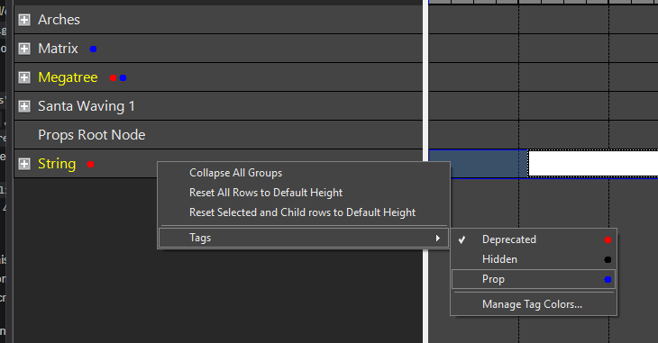
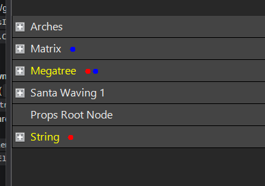
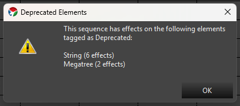

## Overview

Element Tags let you label elements with simple organizational or workflow metadata. See [Element Tags]() in the Display Setup section for a full description of the three built-in tags — **Deprecated**, **Hidden**, and **Prop**. The Sequencer has its own tag assignment menu on the element row list, plus tag-driven behavior specific to sequencing that isn't present in Display Setup or Preview Setup.

### Assigning and Removing Tags

Right-click one or more element row labels in the Sequencer and choose **Tags** from the context menu. As in Display Setup, the submenu lists every tag in the catalog with a checkmark showing whether it's assigned to your selection, and clicking a tag toggles it for every selected row. Tag assignments made here are saved immediately — there's no separate save step.

(*Hint - When multi-selecting several rows, maintain the Shift or Ctrl modifier to retain the multi-select when you right click.*)

Hold **Ctrl** while clicking a tag in the submenu to apply the change to all children of the selected row(s) as well, not just the selected row(s) themselves.

### Tag Color Dots

Each tagged row shows a small colored dot after the element's name for every assigned tag that has a color, ordered left to right by the tag's sort order — the same dot treatment used in Display Setup and Preview Setup.

### Showing and Hiding Hidden Elements

By default, elements tagged **Hidden** — and all of their descendants — are hidden from the Sequencer's row list each time you open a sequence. To show them again, enable **View > Show Hidden**. This setting only affects the current editing session: it isn't saved with the sequence or your profile, so Hidden elements are hidden again the next time you open the sequence.

### Deprecated Elements

Tagging an element **Deprecated** signals that you want to stop sequencing against it, and the Sequencer enforces that:

- You can't add a new effect to a Deprecated row. Dragging an effect from the effects palette onto the row, pasting effects onto it, and the row's own **Add Effect(s)** context menu entry are all blocked. While dragging, the cursor shows the drop is not allowed; when pasting, a status bar message explains that the row was skipped — effects pasted onto other, non-deprecated rows in the same paste are unaffected.
- Moving an existing effect from another row onto a Deprecated row is blocked the same way.
- When you open a sequence that already has effects on a Deprecated element, Vixen shows a one-time dialog listing the affected elements, and how many effects are on each, so you're aware of them. This is informational only — it doesn't block you from continuing to work in the sequence, and it doesn't remap or remove the existing effects.

Removing the Deprecated tag from an element lifts all of these restrictions.

### Managing Tag Colors

Choose **Tags > Manage Tag Colors...** from the row context menu to open the same Element Tag Manager described in [Element Tags]() under Display Setup. Color changes made here are saved immediately.

